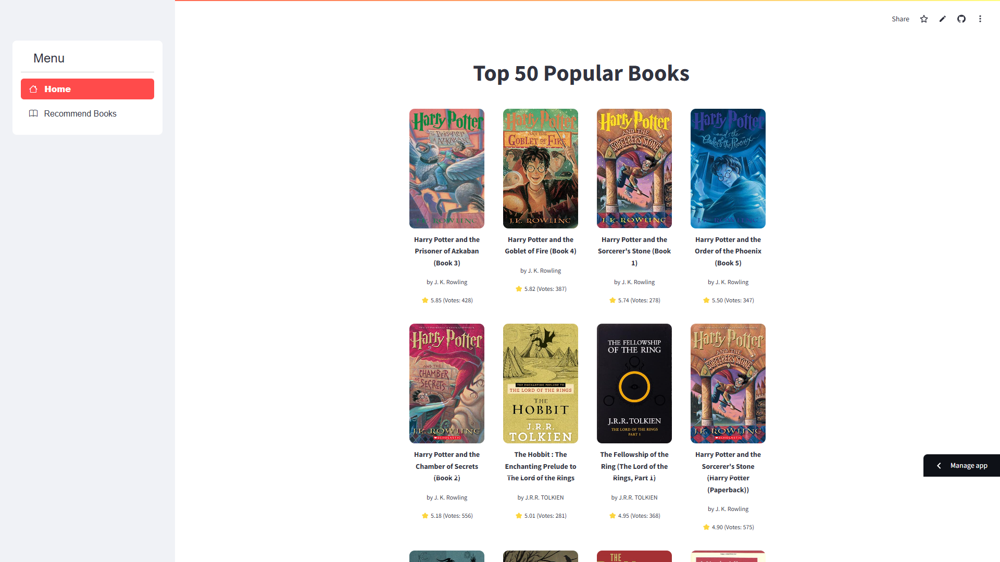
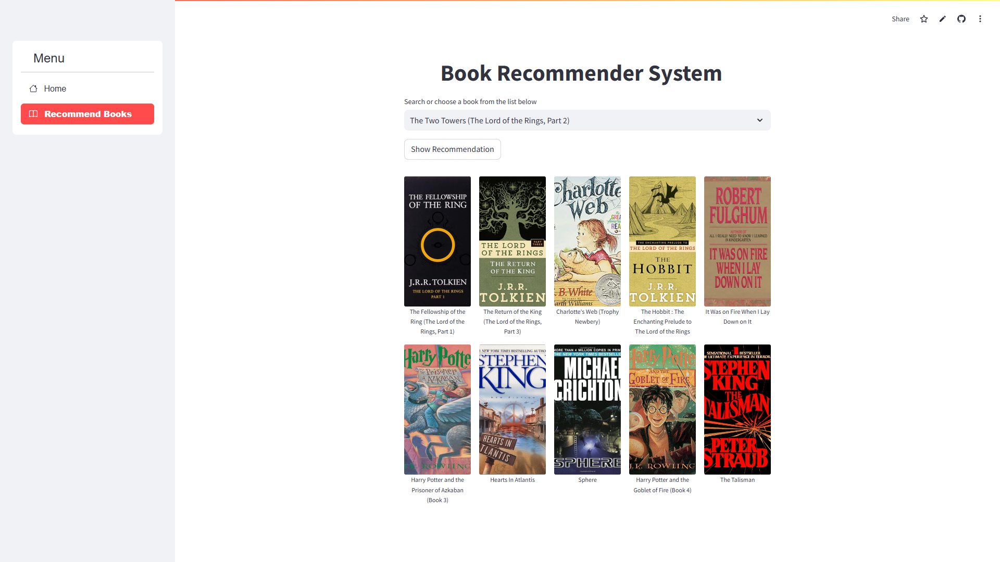

# Book Recommendation System

This is a Book Recommendation System built using Python, Flask, and machine learning. It leverages **cosine similarity** and **K-Nearest Neighbors (KNN)** algorithms to recommend books based on user input.

## Table of Contents
1. [Features](#features)
2. [Technologies Used](#technologies-used)
3. [Deployment](#deployment)
4. [Installation](#installation)
5. [Running the Application](#running-the-application)
6. [Program Snapshots](#program-snapshots)
7. [Contributing](#contributing)
8. [Contact](#contact)

## Features
- Display Top 50 Most Popular Books
- Book Recommendation Based on a User Input
- Interactive and user-friendly web interface

## Technologies Used
- **Python**
- **Flask** for the backend
- **Pandas** and **NumPy** for data manipulation
- **Scikit-Learn** for implementing KNN and cosine similarity
- **Gunicorn** for production deployment

## Installation

1. Clone the repository:
    ```bash
    git clone https://github.com/hanselijahv/book-recommendation-system.git
    cd book-recommendation-system
    ```

2. Create a virtual environment:
    ```bash
    python -m venv .venv
    .venv\Scripts\activate  # On Windows
    source .venv/bin/activate  # On Linux/Mac
    ```

3. Install the dependencies:
    ```bash
    pip install -r requirements.txt
    ```

## Running the Application

1. Start the Flask application using Waitress:
    ```bash
    waitress-serve --listen=localhost:8000 app:app
    ```

2. Access the application at `http://localhost:8000`

## Program Snapshots
Below are snapshots of the Book Recommendation System deployed in Streamlit Community Cloud:

**Home Page**  


**Recommend Page**  


## Contributing
Contributions are welcome! Feel free to fork this repository, submit pull requests, or raise issues for any improvements.

## Contact
For any inquiries, contact [Hans Elijah Viduya](https://www.linkedin.com/in/hanselijahv/).
